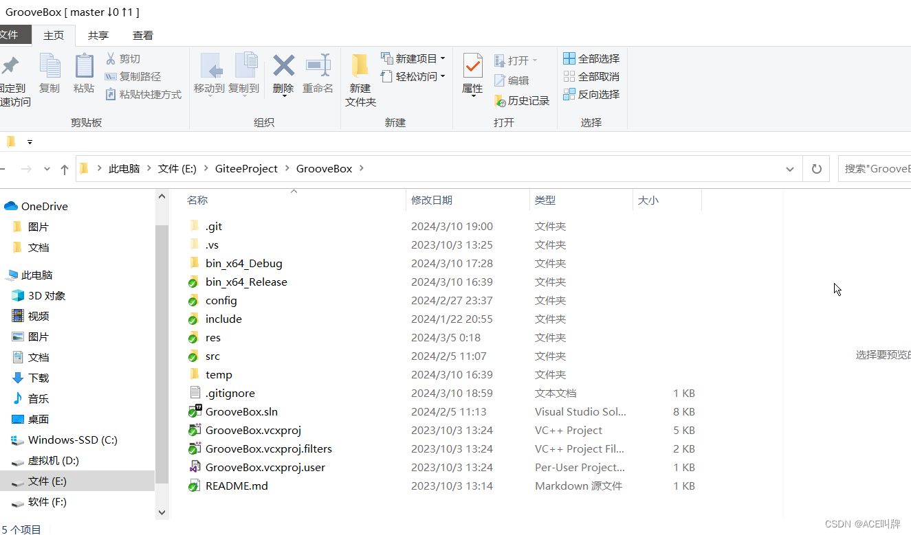
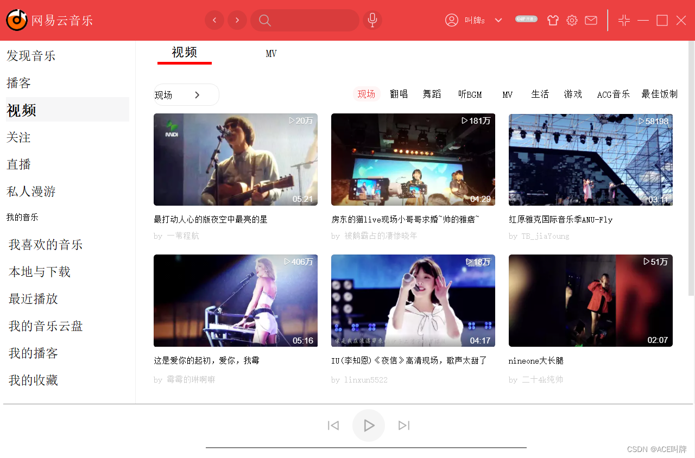

# 基于QT Creator开发的仿网易云音乐播放器

#### 介绍
仿照网易云播放器界面实现，目的在于锻炼C++编程能力，熟练掌握Qt Creator各种组件的使用及样式设置、界面布局、QtPlugin技术、QXml读写XML文件方法、Qss文件的编写及使用等。

### 开发环境
Windows + Visual Studio 2022 + QT 5.9.1 msvc2017_64。

### 安装说明
安装 Visual Studio 2022 + QT 5.9.1，其中QT必须安装msvc2017_64组件

### 技术介绍
1、使用C++语言作为开发语言，包括C11的新特性；

2、Qt 框架的使用：利用了Qt框架的各种组件（QPushButton、QLabel、QLinEdit、QTableWidget、QTabWidget、QStackWidget、QProgressBar、QTimer等）来构建用户界面；

3、XML 文件处理：使用QXml读写XML配置文件完成初始数据的读取，可以通过改写配置文件实现界面的不同；

4、Qt 插件技术：使用QtPlugin使得功能像搭积木一样层层实现；

5、QSS文件：读写QSS文件设置界面样式，例如换肤功能；

6、界面布局：使用QVBoxLayout、QHBoxLayout、QGridLayout进行界面的布局。

### 项目目录

    -bin_x64_Debug：存放Debug版本下的exe和各模块的Debug动态库
    -bin_x64_Release: 存放Release版本下的exe和各模块的Release动态库
    -config：存放各个模块用到的配置文件
    -include
        -public: 存放各个模块共用的头文件
        -interface: 存放提供接口的头文件
    -res: 存放资源图片
    -src: 
		-FollowWith：”关注界面“的源代码
		-HnCore：项目框架的源代码
		-LiveBroadcast：“直播界面”的源代码
		-LocalAndDownload：“本地与下载界面”的源代码
		-MainControl: "总控界面"的源代码
		-MyLikeMusic：“我喜欢的音乐界面”源代码
		-PlayMusic：“播放音乐功能”的源代码
		-PodCast：“播客界面”的源代码
		-PrivateRoaming：“私人漫游界面”的源代码
		-RecentlyPlayed：“最近播放界面”的源代码
		-RotationChart：“轮播图界面”的源代码
		-Runner：main.cpp所在模块
		-Video：“视频界面”的源代码
    -temp: 编译产生的临时文件

### 项目介绍

主界面

网易云主界面：

换肤功能，支持六种颜色：

网易云换肤：

专属订制界面

网易云专属订制界面

歌单界面

网易云歌单界面

排行榜界面

网易云排行榜界面

歌手界面

网易云歌手界面

最新音乐界面

网易云的最新音乐界面

播客界面

网易云的播客界面

视频界面

网易云的视频界面

关注界面

网易云的关注界面

直播界面

网易云的直播界面

我喜欢的音乐界面

网易云我喜欢的音乐界面

本地与下载界面

网易云本地与下载界面

最近播放界面

网易云最近播放界面

推荐歌曲界面

网易云推荐歌曲界面

播放《红昭愿》歌曲

### 特殊说明
私人漫游、我的音乐云盘、我的播客、我的收藏界面因为时间关系尚未完成。